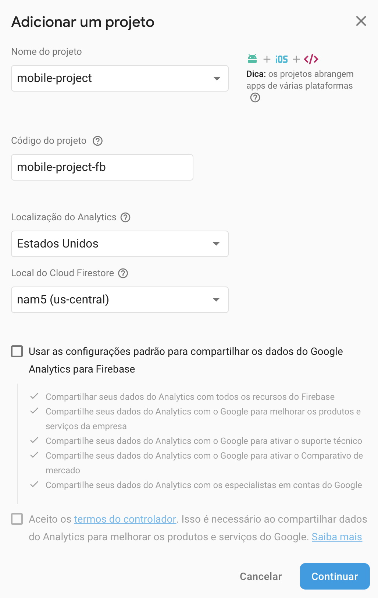
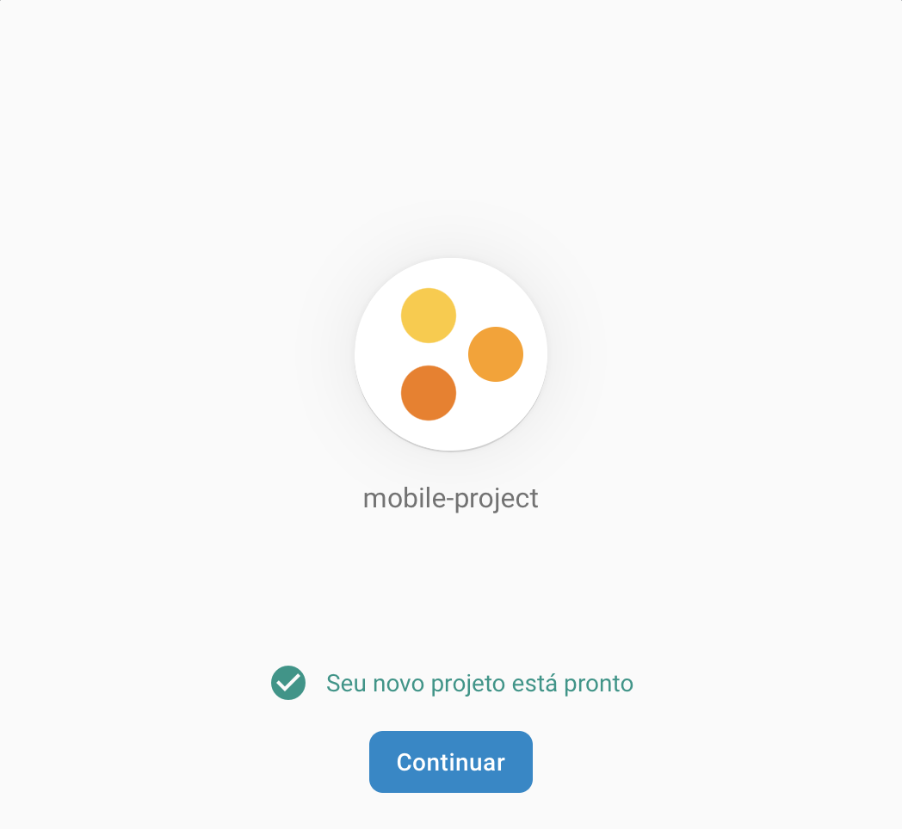

# Firebase App

A simple Android App demonstrating The Firebase Authentication
on Android.

## Instalation

To compile and run this project you must setup a new Firebase Project
on Firebase console and download the **google-services.json** to the App
folder.

To create the Firebase Project:

    
1. Go to the [Firebase Console](https://console.firebase.google.com).
1. Click **Add Project**, then set the Project Name to "mobile-project".
1. Set the Project ID to "mobile-project-fb".

    

 
 

Follow the remaining setup steps in the Firebase console then click 
"**Create Project**" to finish.

 

    

 
 

#### Add Android app to Firebase project:

1. On Project Overview page click **Android button** to add Android app
to the project.
1. When prompted, enter the app's package name
("*com.kenniston.android.firebaseapp*") then click **Register App**.
1. Add the Firebase Android configuration file to the app:
     1. Click Download google-services.json to obtain your Firebase 
     Android config file (**google-services.json**).
     1. Move the config file into the same directory as your app-level 
     build.gradle file.
1. Build project.

     

 

